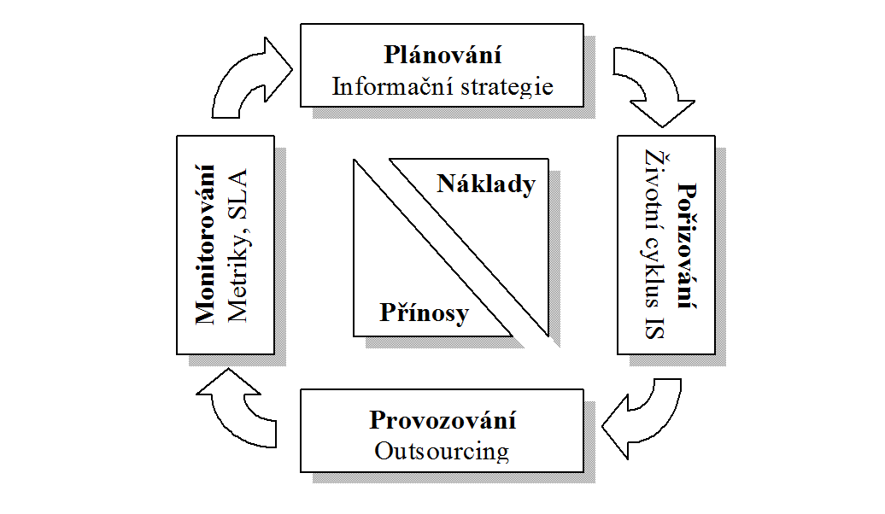
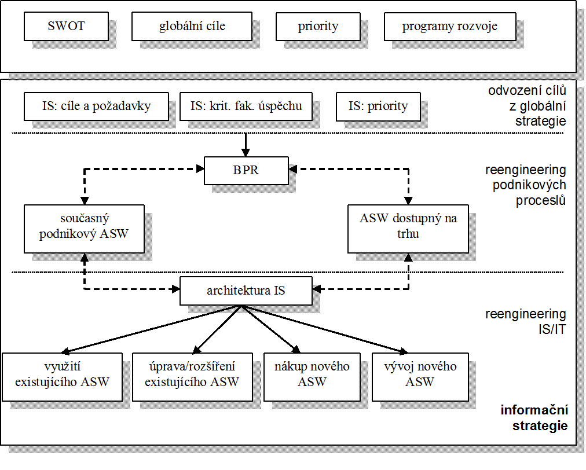
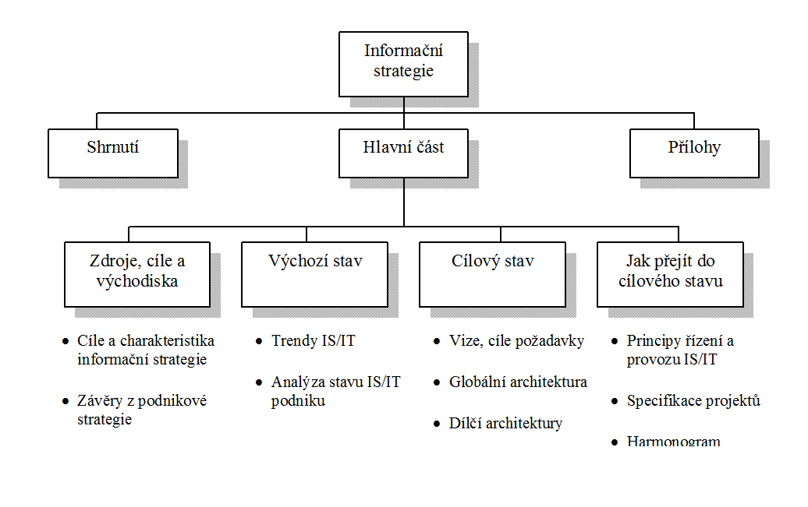
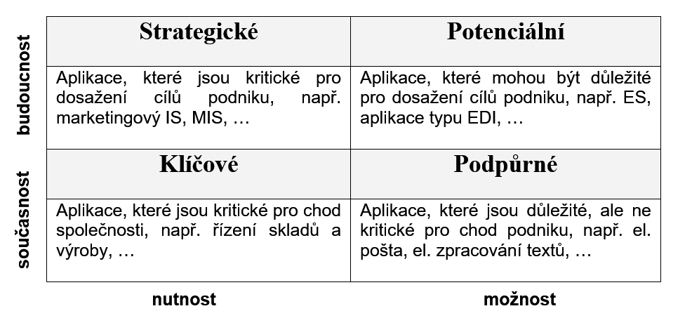
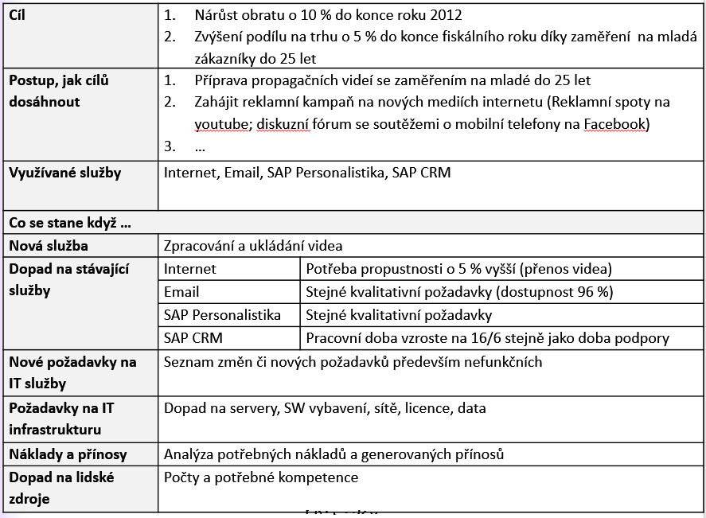
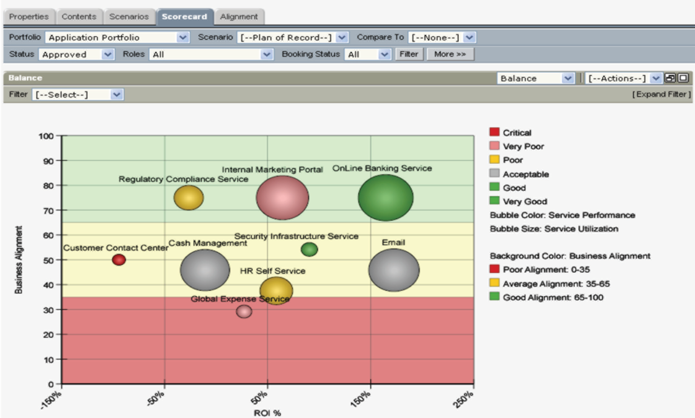
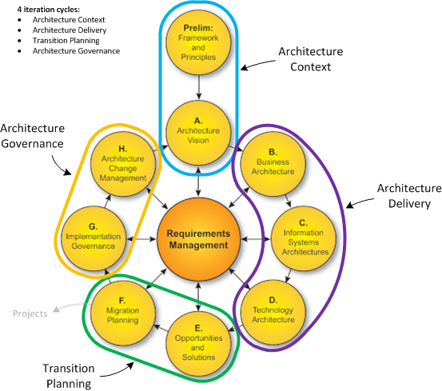
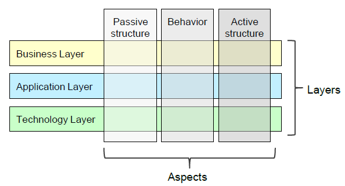
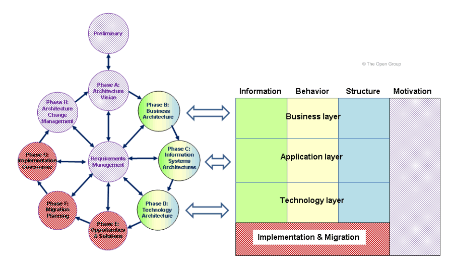
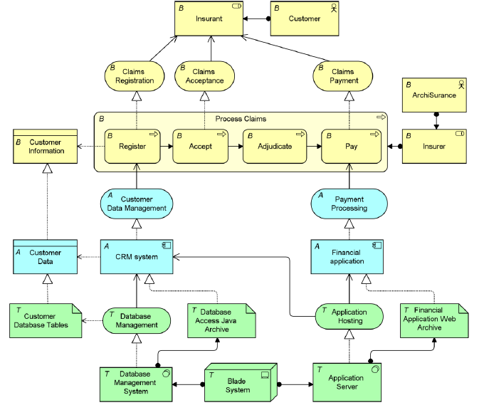

> **Plánování** **IS/ICT** **a** **informační** **strategie**
>
> Řízení ICT bude v tomto učebním textu představeno v podobě čtyř
> základních činností, kterými je plánování, pořizování, provozování a
> monitorování IS/ICT. V každé této činnosti se určitým způsobem odráží
> aspekty výše uvedených oblastí zájmu řízení ICT. Přes návaznost a
> zdánlivou postupnost je důležité uvědomit si, že tyto činnosti
> neprobíhají odděleně, ale mohou být prováděny souběžně a také v
> delších či kratších cyklech. V rámci těchto činností budou uvedeny
> konkrétní problematiky, které s danou fází řízení IS/ICT úzce souvisí.
> Většinou však dané problematiky nesouvisí pouze z jednou fází, ale
> přesahují i do dalších činností.
>
> Plánování IS/ICT je spojeno s informační strategií, resp. s její
> tvorbou. Informační strategie přitom dává základní konceptuální
> vodítko pro využití informatických zdrojů a samotné pořizování IS/ICT.
> Specifika pořizování IS/ICT vycházejí z tzv. životního cyklu IS,
> přesněji s fázemi od úvodní studie až po zavedení do ostrého provozu.
> Samotný životní cyklus IS však nekončí zavedením do provozu, ale právě
> provozem a údržbou pokračuje. Vzhledem k náročnosti provozu a údržby
> se nezřídka přistupuje k tzv. outsourcingu ICT. Další činností je pak
> monitorování provozu a vyhodnocování různých ukazatelů pro případné
> korekce event. plánování dalšího rozvoje IS/ICT. K tomuto účelu jsou v
> textu představeny vybrané metriky pro hodnocení IS a také tzv. service
> level agreement jako nástroj pro řízení výkonnosti v případě
> outsourcingu IS/ICT. Základní metodický rámec zkoumání uvedených
> aktivit tvoří procesní přístup, protože umožňuje hledat odpovědí na
> otázky účelnosti a účinnosti IS/ICT. Veškeré předchozí aktivity jsou
> pak provázány na určování nákladů a přínosů, které lze u IS/ICT
> očekávat.
>
> Zajištění skutečných přínosů IS/ICT není jednoduchou záležitostí.
> Chceme-li vůbec o nějakých přínosech hovořit, je nutné zabezpečit, aby
> prostředky IS/ICT byly využity účelně. Účelné využití IS/ICT vyžaduje
> řízení veškerých aktivit týkajících se IS/ICT určitým plánem, který by
> korespondoval s cíli a
>
> celopodnikovou strategií podniku. Informační strategie (IST)
> stanovuje, jakým způsobem by měly IS/ICT podporovat globální cíle a
> ostatní strategie v relativně dlouhém časovém období. Informační
> strategie by však neměla být zaměřena výhradně na použití technologií.
> Cílem informační strategie je vymezit, jak pomocí informací podpořit
> vytváření a dosažení vize, resp. jednotlivých cílů, podniku. Teprve
> pak lze říci, že je ke správě informací v organizaci možné a také
> vhodné používat moderní počítačové informační technologie. V opačném
> případě v informační strategii chybí podstatné věci, týkající se
> netechnických aspektů podniku, což se může negativně projevit při
> samotném uskutečňování dané strategie.
>
> Informační strategie by se proto neměla omezovat pouze na technologie
> nebo systémy. Již zde je třeba brát zřetel na to, jak se projeví vliv
> technologií na kulturu podniku. Je žádoucí, aby součástí informační
> strategie byla také cíleně směřovaná výchova zaměstnanců k určitému
> informačnímu povědomí. Výchova k informačnímu povědomí zahrnuje
> obeznámení zaměstnanců se základními principy zpracování, vyhledávání,
> uchování a aplikace informací pro řešení konkrétních úkolů, ale i s
> určitou informační etikou a legislativou. Informační povědomí
> zaměstnanců je potom kritické pro pochopení nutnosti změn a přijetí
> nových technologií a systémů. Často se stává, že právě zanedbání této
> stránky informační strategie vede ke zmaření přínosů jinak dobře
> připraveného projektu zavedení nového IS. Důvodem je právě
> nepřipravenost prostředí pro nové IS/ICT.
>
> Samotná informační strategie je tvořena vzájemným dialogem mezi
> vedením podniku a odborníky na informatiku, ať již interními nebo
> externími. Předmětem diskuze by měla být především možná podpora
> podnikových procesů pomocí IS/ICT, nikoliv řešení technických otázek a
> problémů vlastní realizace. Důležitým aspektem informační strategie je
> její celkovost (komplexnost). Není možné, aby informační strategie
> pokrývala pouze některou část informačních potřeb podniku. Informační
> strategie musí přinášet integrované a systematické řešení podnikové
> informační infrastruktury (Molnár 2000).
>
> **Otázky** **na** **informační** **strategii**
>
> Je možné říci, že IST vymezujeme proto, abychom si ujasnili určité
> otázky, které se týkají informačního zabezpečení (zde se zabezpečením
> nemyslí pouze ochrana). V rámci vymezování IST je potřeba vzít v úvahu
> zejména otázky z následujících oblastí:
>
> ● Jaké jsou informační potřeby v dané organizaci? – jaké informace je
> nutné vyhledávat nebo uchovávat a jaké kvantity mohou také informace
> nabývat.
>
> ● Kdo přesně dané informace potřebuje? – to znamená definovat
> informační kompetence; sem spadá také problematika bezpečnosti a
> důvěryhodnosti zdroje informací, tedy toho, kdo o dané informaci vědět
> nemá a komu naopak musí být sdělena a to nejen uvnitř organizace, ale
> také ve vztahu k okolí.
>
> ● Kde se dané informace nacházejí a jak je dostat na to správné místo?
> – zde je také možná úvaha, zda by nebylo efektivnější informace či
> data získávat nebo ukládat někde jinde nebo od někoho jiného.
>
> ● Jaký je současný stav informačních technologií? – v rámci této
> otázky je možné se zabývat tím, v jakém stavu jsou počítačové
> technologie.
>
> ● Jaká jsou informační rizika? – je důležité si ujasnit, jaká je cena
> našich informací a jaká je cena za neoprávněné používaní či jiné
> zneužití nebo jaká je cena za dezinformaci; takovýmto vymezením cen je
> potom možné určit jak „dokonalý“ by měl náš systém být, aby se riziko
> minimalizovalo na přijatelnou úroveň.
>
> Uvedený seznam otázek není s jistotou úplný. Existuje celá řada
> dalších otázek, ale ty se mohou lišit v rámci různých organizací.
> Obecně by se informační strategií mělo rozumět vymezení toho, jaké
> informace jsou pro dosažení cílů potřeba a jaké technologie jsou nutné
> k získání, zpracování, uchování a distribuci takových informací na
> místa, kde budou využity.
>
> Tvorba informační strategie
>
> Informační strategie má v praxi formu dokumentu, který je připraven a
> posléze převeden do konkrétních projektů vrcholovým vedením. Obsahem
> informační strategie je (Voříšek 2002):
>
> ● vymezení současného stavu a způsobu podpory podnikových cílů pomocí
> IS/ICT,
>
> ● stanovení vize, jak by IS/ICT mohly přispívat k dosažení
> jednotlivých cílů, ● určení způsobu, jak je možné současný stav
> podpory IS/ICT přetvořit do
>
> požadované podoby.
>
> Ke zjištění současného stavu IS/ICT je možné použít celou řadu technik
> a nástrojů. K hodnocení současného stavu lze použít také SWOT analýzu
> pro zjištění silných a slabých stránek. Oblasti, které by měly být v
> tomto případě zohledněny, jsou následující (Voříšek 2002):
>
> ● hodnocení stavu IS/ICT konkurence,
>
> ● hodnocení stavu IS/ICT klíčových obchodních partnerů, ● hodnocení
> softwarových aplikací dostupných na trhu,
>
> ● hodnocení trendů v oblasti IS/ICT, ● podniková SWOT analýza,
>
> ● podnikové cíle,
>
> ● požadavky uživatelů.
>
> Cílový stav je možné vymezit různým způsobem. Podle metodiky MDIS
> (Multidimensional Development of IS) je vymezení cílového stavu
> provedeno jednak v tzv. globální architektuře, která určuje základní
> „tvar“, a dále pak v dílčích aspektech, kterými jsou (Voříšek 2002):
>
> ● funkční a procesní architektura, ● datová architektura,
>
> ● technologická architektura, ● softwarová architektura,
>
> ● hardwarová architektura,
>
> ● organizační a legislativní aspekty,
>
> ● personální, sociální a etické aspekty.

> Cílový stav, jako i vlastní transformace současného stavu do
> budoucího, musí vycházet z celopodnikové strategie. V některých
> případech bude nutné na cestě k vymezenému žádoucímu stavu provádět
> větší či menší restrukturalizaci současných procesů IS/ICT. Z analýzy
> současného stavu by mělo vyplynout, který IS nedostatečným způsobem
> podporuje určité podnikové aktivity a je tedy potřeba ho nahradit. Po
> analýze trhu s IS je možné určit, jaké systémy je možné koupit a jaké
> bude nutné vyvinout na objednávku. V případě potřeby vývoje na
> objednávku bude také nutné určit, zda bude systém vyvíjen interně nebo
> zda bude zadán externímu dodavateli. Znázornění informační strategie a
> její realizace je uvedeno na obrázku 20 (Voříšek 2002).
>
> **Struktura** **informační** **strategie**
>
> Na tvorbě informační strategie se podílí tým spolupracovníků.
> Výsledkem jejich úsilí je vlastní definování informační strategie.
> Informační strategii je nejvhodnější zachytit do určitého dokumentu.
> Celý dokument se dělí na několik částí. Podle metodiky MDIS je vhodné
> do dokumentu zařadit následující části – viz obrázek 21 (Voříšek
> 2002).
>
> Je zřejmé, že vypracováním informační strategie není ještě zajištěno
> řízení IS/ICT. Řízení IS/ICT není možné redukovat na vytvoření
> nějakého dokumentu. Na druhou stranu bez informační strategie, a tedy
> bez nějakého jasně vymezeného cíle a

> způsobu, jak se k cíli dopracovat, by se řízení IS/ICT velmi
> pravděpodobně míjelo účinkem (Voříšek 2002). Stejně tak je potřeba
> chápat, že s tím, jak se rychle mění situace v ICT, je potřeba také
> upravovat informační strategii. Informační strategie proto není
> statickým dokumentem, ale neustále se vyvíjí promítáním různých ICT na
> informační potřeby podniku.
>
> **Nástroje** **tvorby** **informační** **strategie**
>
> Nástroje v plánování IS/ICT jsou prostředkem k uplatnění nebo
> provedení určité techniky. Umožňují zaměření a zdůraznění určitého
> aspektu zkoumané problematiky. Umožňují formalizaci činností a
> výstupů. Typy nástrojů:
>
> ● Výčet (někdy také katalog) ● Matice / Tabulka
>
> ● Diagram
>
> Matice odpovědností
>
> RACI Chart – vymezení rolí při plnění určitého úkolu nebo zajištění
> procesu. Role:
>
> ● **Odpovědný** (Responsible) – provádí činnost
>
> ● **Zodpovědný** (Accountable) – přiděluje a schvaluje činnost,
> případně je zodpovědný za nápravu
>
> ● **Konzultant** (Consulted) – doménový expert na činnost
>
> ● **Informovaný** (Informed) – jednosměrná komunikace např. o
> problémech nebo dokončení činnosti
>
> McFarlanův model aplikačního portfolia

> McFarlanův model aplikačního portfolia, který vychází z principu
> Bostonské matice. McFarlanův model je zaměřen na analýzu přínosů
> jednotlivých aplikací z hlediska současného a budoucího použití. Míra
> přínosů je určena tím, zda se podnik nemůže bez dané aplikace obejít
> nebo zda má pouze podpůrnou funkci
>
> **Podnikové** **scénáře**
>
> **Service** **Portfolio** **Scorecard**
>
> Nástroj pro sledování služeb. Sledované charakteristiky:

> ● ROI (%) … Osa X
>
> ● Business Alignment … Osa Y ● Využití … velikost bodu
>
> ● Výkonnost … barva bodu
>
> **Podniková** **architektura** **(Enterprise** **Architecture** **-**
> **EA)**
>
> Architektura – spojení vědy a umění při navrhování složitých struktur,
> které naplňují požadovanou funkcionalitu a zmírňují složitost. Koncept
> používaný pro plánování IT zohledňující strategické záměry a
> podnikatelský model. Podniková architektura představuje konkrétní
> uspořádání obchodních procesů, informačních toků, datových úložišť a
> jiných komponent IT infrastruktury. Význam EA:
>
> ● Nástroj pro řízení – podpora rozhodování, standardizace, životní
> cyklus zdrojů ● Způsob dokumentace – popis struktury z různých pohledů
> zachycený v
>
> definovaných modelech
>
> Architektonický rámec poskytuje základní modely upořádání široké škály
> architektur. Popisuje postupy tvorby cílového stavu určitého systému
> (např. podniku) v podobě konkrétních stavebních bloků a poukazuje na
> jejich provázanost. Dává k dispozici množinu nástrojů a jednotný
> slovník. Doporučuje odpovídající standardy a vyhovující produkty
> sloužící pro tvorbu stavebních bloků. Známé architektonické rámce:
>
> ● Zachmann Framework
>
> ● Enterprise Architecture Planning
>
> ● NIST Enterprise Architecture Model ● TOGAF
>
> **TOGAF**
>
> TOGAF – (The Open Group Architecture Framework) je otevřený
> architektonický rámec. Poskytuje postupy a nástroje pro podporu
> přijetí, tvorby, provozu a údržby celopodnikové architektury
> (Enterprise Architecture). Je založen na iterativním procesním modelu
> a uplatnění nejlepších praktik s ohledem na využití stávajících
> architektonických aktiv.
>
> Proč TOGAF? Je výsledkem spolupráce 300 členů z předních institucí
> zabývajících se vývojem vhodné architektury. Dává základ pro vytvoření
> konzistentní architektury, které odráží požadavky zainteresovaných
> stran. Zachycuje nejlepší praktiky v daném oboru. Bere zřetel na
> současné požadavky a zároveň budoucí potřeby firmy. Snižuje rizika
> neúspěchu při tvorbě podnikové architektury.
>
> **Typy** **Architektur** **v** **TOGAF**
>
> ● **Firemní** **architektura** (Business) – definuje strategii, modely
> řízení a organizace, klíčové procesy
>
> ● **Datová** **architektura** – logické a fyzické uspořádání datových
> zdrojů a systémů pro jejich správu
>
> ● **Aplikační** **architektura** – základní nástin jednotlivých
> aplikací a jejich interakcí včetně návaznosti na hlavní procesy
>
> ● **Technologická** **architektura** – popisuje požadavky na SW a HW,
> které jsou potřeba pro nasazení aplikačních služeb
>
> **Struktura** **TOGAF**
>
> Úvod – základní principy a termíny
>
> Architecture Development Method (ADM) – jádro TOGAF; postup tvorby
> celopodnikové architektury
>
> ADM Guidelines and Techniques – principy a pravidla při aplikaci TOGAF
> a ADM
>
> Architecture Content Framework – popis metamodelu architektonických
> artefaktů, stavebních bloků a typických výstupů
>
> Enterprise Continuum & Tools – nástroje pro třídění výstupů
> jednotlivých činností TOGAF Reference Models – referenční modely
>
> Architecture Capability Framework – organizace procesů, rolí,
> odpovědností a požadované kvalifikace jednotlivých činností
>
> **ADM** **cyklus**
>
> ● Přípravná fáze ● Vize
>
> ● Podniková architektura
>
> ● Architektura informačního systému

> ● Technologická architektura ● Příležitosti a řešení
>
> ● Plánování migrace ● Zavedení
>
> ● Rozvoj architektury ● Analýza požadavků
>
> **ArchiMate**
>
> Specifikace pro modelování podnikové architektury. Vytvářena a
> spravována konsorciem The Open Group. Modelovací jazyk pro formální
> popis, analýzu a vizualizaci prvků a vztahů v podnikatelské činnosti.
> Podporuje vytváření podnikové architektury dle ADM metody v TOGAFu.
> Zahrnuje paradigma IT orientovaného na služby.
>
> Základ jazyka ArchiMate **Obecné** **typy** **elementů**
>
> ● Aktivní (Active structure) – prvky, které se vyznačují skutečným
> chováním (aktéři, aplikace, zařízení, …)
>
> ● Chování (Behaviour) – prvky reprezentující chování (procesy, funkce,
> události, …)

> ● Pasivní (Pasive structure) – prvky reprezentující objekty, jež jsou
> chováním ovlivněny (datové objekty, dokumenty, …)
>
> **Úrovně**
>
> ● Firemní úroveň – zachycuje interakce mezi firemní strategií, firemními
> procesy, funkcemi
>
> ● Aplikační úroveň – zachycuje interakce v rámci informačních systémů
>
> ● Technologická úroveň – zachycuje infrastrukturní služby, logické a
> fyzické komponenty
>
>  style="width:6.27083in;height:3.69792in" />**ArchiMate** **a**
> **TOGAF**

> **Vztahy**
>
> ● **Strukturní** – vztahy modelující statické složení nebo propojení
> souvisejících prvků do složitějších konceptů
>
> ● **Závislosti** – modelují, jak prvky podporují jiné prvky
>
> ● **Dynamické** – modelují perspektivu časově závislého chování prvků
> ● **Ostatní** – vztahy nespadající do žádné z výše uvedených kategorií
>
> Fáze: Tvorba BA **Cíle**
>
> ● Popis současné architektury
>
> ● Popis cílové architektury včetně organizačních, funkčních a
> procesních aspektů odvíjejících se z podnikových cílů a strategie
>
> ● Analýza rozdílu současnou a cílovou architekturou
>
> ● Výběr odpovídajících perspektiv pro zohlednění potřeb
> zainteresovaných stran ● Výběr vhodných nástrojů a technik
>
> Přístup: Modelování – procesní modelování, use case modelování,
> zachycení struktury, modelování komponent.

**Pořizování** **informatických** **zdrojů**

Jedním z výstupů informační strategie by mělo být formulování potřeby
pro pořízení IS zároveň s věcnou (tj. z hlediska definování vybraných
procesů, které by měl daný IS podporovat nebo automatizovat), technickou
a časovou koordinací takové potřeby. V textu bylo již dříve uvedeno, že
pořízení IS může mít celou řadu forem. Může se jednat o nakoupení,
vývoj, modifikaci, přizpůsobení stávajícího řešení apod. Ve všech
případech samotné pořízení probíhá v několika etapách tzv. životního
cyklu IS. Existují různé přístupy a podnikové metodiky, které se často
liší názvy a rozdělením jednotlivých etap. Podstata činností bývá ovšem
společná. Nejde tedy o konkrétní názvy ani přesný způsob dělení do etap,
ale o časovou návaznost a obsahové vymezení daných činností.

Úvodní studie

Úvodní studie, někdy též označovaná jako studie proveditelnosti
(Feasibility Study), by měla dát kvalifikovanou odpověď na otázku, zda
daný projekt IS realizovat nebo ne. V této chvíli není neúspěch, pokud
výsledek úvodní studie bude nerealizovat daný IS a projekt bude ukončen.
V úvodní studii jde o jasnou formulaci cílů daného IS, přínosů a dopadů
pro podnik z nejrůznějších hledisek (procesní, organizační, personální,
finanční, technické atd.). Dále pak o vymezení rozsahu daného IS a
propojení na okolí. Tyto závěry vycházejí ze základní analýzy požadavků
a definování omezujících podmínek.

Podle stanovených cílů a analýzy požadavků mohou být hrubě odhadnuty
náklady na pořízení IS. Samotná cena může být odhadnuta podle zkušeností
z minulých projektů, zejména pokud se uvažuje o vlastním vývoji. Jinak
je cena zjištěna u případných dodavatelů rozesláním požadavku o určení
ceny tzv. RFQ/RQP (Request for Quote/Request for Proposal). Nezřídka je
samotné určení ceny případným dodavatelem daleko složitější a řídí se
firemními pravidly, kdy se opět využívá zkušeností s podobnými projekty.
Snahou samozřejmě také je nabídnout co nejnižší cenu a získat zakázku s
tím, že konečná cena bude stanovena až po podrobné analýze požadavků a
koncepčním návrhu daného řešení. Odhadnuté náklady pak mohou být
konfrontovány s očekávanými přínosy, čímž dojde k rozhodnutí o
uskutečnění nebo zastavení projektu.

V rámci úvodní studie pro zavedení IS je také třeba hledat odpovědi na
otázky spojené s odhodláním podniku daný projekt realizovat. Zde je
možné zkoumat např. následující otázky (Vrana, Richta 2005):

> ● **Opravdu** **potřebujeme** **IS?** – není potřeba unáhlená? Nejedná
> se o popud módnosti? atd.; odpověď by měla dát právě informační
> strategie; nutnost hledat odpověď na tuto otázku je především v
> případě, že informační strategie není;
>
> ● **Uvědomujeme** **si** **rizika** **projektu** **IS?** – každý
> informatický projekt provází řada problémů, které zavádění IS
> komplikují; zde by se mělo jednat o vyhodnocení, zda jsme ochotni daná
> rizika podstoupit;
>
> ● **Vytvoříme** **projektu** **IS** **přiměřené** **podmínky?** –
> jedná se o podporu vedení a zajištění potřebných prostředků
> (organizačních, finančních, lidských, technických).

Snaha najít odpovědi na tyto, ale i další otázky přivádí k problematice
určení proveditelnosti daného projektu. Proveditelností v tomto kontextu
můžeme rozumět schopnost projekt řídit a úspěšně dokončit (Vrana, Richta
2005). Zajímavé je potom zkoumat, jaký podíl na proveditelnosti (úspěchu
projektu) má jaký faktor. Podle tohoto modelu by v ideálním případě byla
proveditelnost 100%. Jelikož v praxi ale nebývá naplnění daných faktorů
nikdy maximální, klesá proveditelnost pod toto maximum. Zásadní problémy
pak nastávají, pokud hodnota klesne pod 50% (Vrana, Richta 2005).

Úvodní studie může být zpracována zadavatelem budoucího systému,
případně i potenciálním dodavatelem jako součást podkladů pro výběrové
řízení. Může být ale také zpracována třetí stranou. Minimálně však
stanovení základních cílů, resp. vize, či představy o budoucím systému,
je úkolem především pro management podniku. Tuto odpovědnost není vhodné
delegovat ani na třetí stranu, ani na podřízené. Existuje pro to celá
řada důvodů, které se však na první pohled nemusí zdát jako dostatečně
pádné, což je zrádné. Hlavním důvodem je potřeba stanovení jasné
představy, proč podnik daný systém potřebuje a co od něj očekává. Tuto
představu bude nutné sdělit jednak dodavateli, a jednak také svým
zaměstnancům. Především management by měl mít dostatečný nadhled nad
řízeným podnikem, aby byl schopný definovat, co bude pro podnik přínosem.

V případě, že by cíle měl definovat někdo z třetí strany, je zde velké
riziko, že problémům podniku neporozumí a že jeho hlavním cílem bude
rychle dát něco dohromady a „zmizet“. Pokud by takový úkol dostal např.
zaměstnanec v oddělení ICT, byla by představa určitě velice moderní a
technicky na úrovni, ale hodnota pro podnik by se asi ztrácela ve
zbytečných technických vymoženostech. Pro úspěch celého projektu je
potřeba, aby management přijal představu o novém IS za svou, protože
jinak při prvních problémech hrozí zastavení projektu.

Výběr dodavatele a systému

V tuto chvíli předpokládejme, že řešení bude dodáno externím
dodavatelem, a proto je nutné jej nejdříve vybrat. Při rozhodování o
výběru dodavatele je možné obrátit se na konkrétního dodavatele přímo,
většinou na základě referencí, případně předchozí spolupráce, nebo
uspořádat veřejné výběrové řízení (pro veřejný sektor a státní správu
platí pouze třetí možnost).

Při pořizování IS/ICT hraje roli celá řada parametrů, podle kterých se
porovnávají jednotlivé nabídky. Mezi standardní parametry ASW patří
(Molnár 2000):

> ● **Základní** **údaje** (tvůrce, distributoři, rok zahájení prodeje,
> orientace na sektor, velikost podniku, cena, lokalizace).
>
> ● **Architektura** **ASW** (skladba modulů, vazby modulů, vazby na
> další aplikace, možnosti rozšíření).
>
> ● **Přehled** **instalací** (svět, ČR).
>
> ● **Provozní** **prostředí** (technologická architektura, databázové
> prostředí, orientace na základní SW).
>
> ● **Metodika** **zavádění** (tradiční, agilní, robustnost,
> propracovanost, otevřenost, zkušenosti).
>
> ● **Vývojové** **prostředí** (podpora některého CASE nástroje,
> charakteristiky uživatelského rozhraní, standardy uživatelského
> rozhraní).
>
> ● **Dokumentace** **a** **jazykové** **prostředí** (počet jazyků,
> možnost přepínání, rozsah a struktura dokumentace – provozní,
> uživatelská, vývojářská, dokumentace pro nasazení).
>
> ● **Doplňující** **služby** (servis, upgrade, školení, helpdesk,
> konzultace). ● **Standardy,** **normy,** **certifikace** (audit,
> podpora ISO 9000-3).
>
> ● **Flexibilita** (možnosti úprav, přizpůsobení, rozšíření).
>
> ● **Funkční** **struktura,** **specifické** **funkce** – co umí
> (evidenční, operativní, analytická, plánování, kontrolní funkce).

Mimo výše uvedené parametry je vhodné zabývat se při výběru dodavatele
či systému také rizikovostí nabídky. V obecné rovině se rizika týkají
nedodržení časového harmonogramu, rozpočtu, kvality.

Důležitým parametrem je samozřejmě také cena, i když by to neměl být
parametr nejdůležitější nebo jediný. Ukazuje se, že to, co se zdá být
vcelku logické, nebývá často respektováno. Tím logickým je, že to
nejlevnější většinou není to nejlepší. V tomto směru nejsou ojedinělé
případy, kdy pro získání zakázky na nákup či budování nějakého ASW
vznikne nová firma, která nemá žádné zkušenosti s podobnými aktivitami,
ale zakázku získá právě kvůli nejnižší ceně.

**Zavedení** **a** **testovací** **provoz**

Pomineme-li pro zjednodušení samotný vývoj systému, je dalším významným
krokem proces zavádění, nasazování nebo implementace systému do reálného
prostředí a ověřovací provoz. Tuto fázi bychom mohli nazvat „hodinou
pravdy“, protože dochází k odhalování nedostatků a chyb. Kromě
odlaďování chyb, které nebylo možné v „laboratorních“ podmínkách
simulovat, je tato fáze spjata především s převodem dat do nového
systému a školením pracovníků.

V mnohých projektech je převod dat podceňovanou záležitostí. V některých
případech je opomíjen úplně, a to dokonce záměrně z důvodu snížení ceny.
Vzhledem k nevyzpytatelnosti původních systémů, daných postupným
„dolepováním“ dodatečných modulů, nepřípustným zjednodušováním vývoje,
nedostatečnou dokumentací atd., jde ve většině případů o značný problém.
Ten je navíc umocněn faktem, že je nutné převedení dat provést co
nejrychleji a že může být složité případné chyby objevit i opravit.
Pokud se nějaká chyba objeví, je navíc také velmi pravděpodobné, že bude
nutné provést celý převod ještě jednou.

V současnosti je možné využít, tzv. datové pumpy, využívané také pro ETL
procesy v řešení datových skladů. Bývají součástí databázových systémů.
V některých specifických případech je ovšem nutné datové pumpy upravit,
což může být poměrně náročné.

Odpovídající školení uživatelů bývala další podceňovaná činnost. Podle
jedné studie školení představuje v průměru 8 % nákladů z celého
projektu. Skutečné náklady za školení se ale mohou vyšplhat až na 30 %
nákladů projektu (Beatty, Williams 2006). Vhodný systém školení je
přitom obranou proti skrytým nákladům plynoucím z dlouhodobě nesprávného
používání systému. Podniky často využívají model, kdy jsou u dodavatele
vyškoleni pouze klíčoví uživatelé. Klíčoví uživatelé jsou poté odpovědni
za vyškolení ostatních koncových uživatelů. Uvedený model může být
finančně výhodnější, ale neměl by skončit tak, že tito klíčoví uživatelé
dostanou jen

základní instrukce a po večerech se nový systém učí z příruček. To vede
k některým chybám v ovládání či mylným zvyklostem, které se potom šíří
mezi ostatními koncovými uživateli. Tomuto jevu se dá předcházet
certifikací u dodavatele na ovládání daného systému. Výhodou ovšem může
být více individuální přístup ke koncovým uživatelům místo méně účinných
hromadných školení. Je třeba se ovšem vyhnout také tzv. „Hey Jack“
problému (viz skryté náklady).

V rámci testování jde především o odhalení odchylek od požadované
funkcionality, současně také o ověření použitelnosti a uživatelské
přívětivosti. Testování by mělo být prováděno v průběhu celého vývoje
systému. Některé chyby ovšem nelze odhalit jinak, než při běžném
provozu.

V návaznosti na definování požadavků na funkcionalitu systému by měly být
vytvářeny tzv. uživatelské akceptační testy. Jejich splnění by mělo být
součástí smlouvy a podmiňovat dokončení systému. Samotné akceptační
testy mají podobu scénářů pro provedení určitých úkonů. Přitom se
sledují definované parametry chování systému.

Poměrně častým problémem je uživatelská přívětivost řešení. Nezřídka se
totiž stávalo, že řešení uživatelského rozhraní vykazovalo značné chyby
v použitelnosti. Příkladem mohou být špatně zvolené nebo umístěné
ovládací prvky vedoucí ke zmatení běžného uživatele. Příčinou tohoto
problému je nedodržení základních pravidel návrhu uživatelského
rozhraní. Může se také stát, že je uživatelské rozhraní navrženo pro
počítačově zdatné pracovníky, přestože skutečnými uživateli budou
začátečníci.

**Provozování** **IS/ICT** **a** **outsourcing** **IS/ICT**

Stále rychleji se vyvíjející a měnící technologie, krátká morální
životnost jak SW, tak i HW prostředků a potřeba jejich aktualizace
znamenají pro podnik značnou zátěž. Konkurenceschopnost podniků je
podmíněna investicemi nejen do nákupu nových SW a HW prostředků, ale
také do najímání nových kvalifikovaných odborníků či školení odpovědných
pracovníků a podobných záležitostí. Zjištění návratnosti těchto investic
a tedy jejich odůvodnění je poměrně problematické, což činí řízení a
podporu podniku pomocí IS/ICT složitější. Vzhledem k narůstající
složitosti a s tím související náročnosti provozu, správy i údržby
softwarových systémů a také k nutnosti neustále se věnovat IS/ICT
problematice, se začal prosazovat trend tzv. vytěsnění, neboli
outsourcingu, procesů IS/ICT.

„Outsourcing je zajišťování činností spojených s informatikou
dodavatelsky, tedy formou externích služeb.“ (Gála a kol. 2006)

Vytěsnění (outsourcing) vede ke zbavení podniku nepodstatných činností,
resp. takových činností, které přímo nesouvisí s hlavním předmětem
podnikání daného podniku. Příkladem takových neinformatických činností
je správa a údržba budov, ve kterých firma podniká, uklízení prostor,
zajištění stravování pro zaměstnance, provoz zařízení pro měření
rychlosti vozidel ve městě apod. Z informatických činností se pak může
jednat o provozování technických prostředků, aplikací, internetových
stránek, zajištění tiskových služeb, správu poštovních účtů apod.
Předmětem outsourcingu může být jenom několik samostatných činností nebo
naopak celá oblast jako například IS/ICT. Z celého spektra různých
skupin činností, které se podnik snaží

převést na externího dodavatele, se vyjímají čtyři nejčastěji používané.
Jedná se o (Voříšek a kol. 2004):

> ● kompletní outsourcing,
>
> ● outsourcing provozu technického vybavení, ● outsourcing systémové
> integrace,
>
> ● outsourcing aplikací (ASP – Aplication Service Providing).

Kompletní outsourcing znamená přenesení všech činností v určité oblasti
na dodavatele včetně příslušného technického vybavení a lidských zdrojů.
Úkolem dodavatele v případě outsourcingu systémové integrace je správa
provozu heterogenních IS klienta a jejich vzájemné propojení včetně
propojení s externími subjekty.

Samotný podnik, oproštěn od vedlejších činností, se může intenzivněji
věnovat své primární náplni, což umožňuje zeštíhlení vedení a i
samotného podniku a tak se podnik stává daleko dynamičtějším a
flexibilnějším. Ovšem zavedení outsourcingu není jednoduché ani levné.
Očekává se však, že přenechání určitých činností na jiný podnik přinese
snížení nákladů. Z hlediska snížení nákladů by měl outsourcing snížit
náklady v následujících oblastech (Molnár 2000):

> ● snížení investičních nákladů, ● snížení provozních nákladů,
>
> ● snížení rizik mimořádných nákladů spojených s výpadky IS/ICT, ●
> snížení nákladů na školení personálu v IS/ICT,
>
> ● získání lepší kontroly nad výdaji na IS/ICT,
>
> ● možnost získání finančních prostředků prodejem aktiv IS/ICT.

Vzdát se určitých činností může podniku ulehčit od určitých problémů.
Outsourcing přináší ovšem také určitá rizika, se kterými je nutné
počítat (Dohnal 2002):

> ● dlouhodobá závislost na jednom dodavateli; výměna dodavatele v ICT
> je celkem náročná záležitost,
>
> ● riziko úniku citlivých informací,
>
> ● nedostatečná orientace dodavatele v oblasti podnikání zákazníka, ●
> špatné nastavení smluvních vztahů,
>
> ● možný vznik konfliktních situací; cíle obou stran se mohou lišit, ●
> podcenění pravidel kooperace.

Outsourcing byl měl pomáhat využívat externí zdroje a tím vlastnímu
podniku ušetřit námahu, čas i peníze. Skutečnost ovšem závisí na celé
řadě faktorů. Jedním z nejdůležitějších faktorů určujících výsledný
efekt outsourcingu je smlouva o outsourcingu. Smlouva o outsourcingu
vymezuje práva, povinnosti, závazky, kvalitu služeb a jiná vzájemná
ujednání obou stran, tj. jak klienta, tak i dodavatele. Outsourcing není
formou partnerství. Obě strany většinou neuzavírají smlouvu o podílu na
zisku. Jedinou motivací k plnění povinností je vhodně stanovená vzájemná
dohoda (Lee 2004). Součástí smlouvy o outsourcingu je celá řada
vzájemných ujednání, která pokrývají oblasti (Lee 2004):

> ● **Úroveň** **služeb** – přesné vymezení typu, rozsahu a kvality
> činností společně s počtem opakování event. přesným časem prováděných
> činností. Součástí této oblasti je také stanovení metrik výkonu
> dodavatele, které budou sloužit pro klienta jako měřítko plnění
> závazků a také jako podklad pro penalizaci dodavatele za jejich
> neplnění nebo nezpokutování služeb v zadané kvalitě. Čím podrobnější
> je tato část, tím menší mohou být v budoucnu spory o jednotlivých
> bodech.
>
> ● **Převod** **aktiv** – v případě, že k provádění činností dodavatel
> potřebuje například specifické vybavení zákazníka, je nutné dojednat
> způsob převodu daných zařízení a jiného majetku. Týká se to zejména
> majetku jako je HW, licence, komunikační a síťová zařízení apod.
> Převod majetku se často realizuje jako odkoupení, což může být
> komplikováno složitým určováním ceny jednotlivých zařízení a nutností
> kontaktovat další subjekty např. v případě převodů výhodných licencí
> na jiný podnikatelský subjekt. Převod aktiv si může vyžádat dodatečné
> náklady, které by měly být započítány do celkových nákladů na
> outsourcing.
>
> ● **Přechod** **zaměstnanců** – ve smlouvě o outsourcingu je často
> potřebné dojednat také přechod zaměstnanců, kteří doposud pracovali ve
> firmě klienta, do firmy dodavatele. Například při poskytnutí
> outsourcingu v roce 2003 firmě JPMorgan zabezpečované firmou IBM, přešlo
> z JPMorgan do IBM něco kolem 4000 pracovníků (Kawamoto 2004). V
> některých státech a případech může být zajištění přechodu značně
> nákladné (např. odchodné pro pracovníky, kteří nemohou přejít k
> dodavateli apod.).
>
> ● **Ceny** **a** **splácení** – sjednání outsourcingu se většinou týká
> delšího časového období. V některých případech je doba sjednaná i na
> 10 let. Ve smlouvě je nutné přesně specifikovat kolik, kdy, jak a komu
> se má cena, resp. splátka zaplatit. Navíc je nutné počítat s tím, že
> se situace může změnit. Vzhledem k rychlému technologickému pokroku a
> dalším faktorům v podnikatelském prostředí se dlouho trvající smlouva
> o outsourcingu neobejde bez jasně specifikovaných pravidel změn.
> Požadované změny, ať již na straně klienta, dodavatele nebo změny
> způsobené externími subjekty, se velmi pravděpodobně promítnou do
> samotné ceny. Je proto vhodné specifikovat přímo do smlouvy termíny
> přehodnocení platebních podmínek.
>
> ● **Stanovení** **záruk** – v případě neplnění stanovených závazků
> dodavatelem může vzniknout klientovi určitá škoda. V případě velkých
> společností se škody většinou vyšplhají i u relativně malých problémů
> s ICT do velkých částek. Spory o tom, jaká škoda vznikla a do jaké
> míry je na tom dodavatel odpovědný mohou být značně komplikované,
> pokud neexistují jednoznačná dojednání, v jakých případech a v jakém
> rozsahu nese dodavatel za výpadky v poskytovaných službách
> odpovědnost.
>
> ● **Řešení** **sporů** **a** **ukončení** **smlouvy** – během doby,
> kdy jsou určité služby poskytovány externím dodavatelem, může nastat
> mnoho sporných situací. Urovnávání nejrůznějších sporů může být
> poměrně nákladné a leckdy vyžaduje i právnickou pomoc. Přestože se
> celá řada konkrétních sporných situací nedá dost dobře předem
> předvídat, je dobré do samotné smlouvy zakomponovat určitá pravidla
> řešení konfliktů (např. stanovením nezávislých arbitrů). Pokud klient
> není s poskytovanými službami spokojen, může po vypršení sjednané doby
> outsourcing ukončit nebo v případě, že spory již nelze
>
> urovnat, může dojít k předčasnému vypovězení smlouvy. Pro klienta
> ovšem nastává komplikovaná situace spojená s otázkou, jakým způsobem
> převzít odpovědnost od dodavatele a co všechno by měl dodavatel po
> ukončení vztahu vrátit. Stejně jako v ostatních případech je dobré,
> když je vývoj při vypovězení nebo ukončení smlouvy předem dohodnut a
> postupuje podle předem stanoveného plánu. Mimo přesně stanovených
> podmínek, za kterých lze smlouvu ukončit, by v plánu nemělo chybět
> ujasnění následujících otázek (Lee 2004):
>
> ○ Jak naložit s technickým vybavením (v případě zpětného odkoupení
> stanovení výpočtu ceny)?
>
> ○ Jak bude naloženo se smlouvami s třetími stranami (např. o leasingu,
> licencích, patentech apod.)?
>
> ○ Jak bude přeneseno know-how a data?
>
> ○ Co s pracovníky, kteří přešli k dodavateli?
>
> ○ Jak bude zajištěna součinnost dodavatele při předávání?

Je celkem zřejmé, že v době ukončování smlouvy mohou být vztahy mezi
klientem a dodavatelem poměrně vyhrocené, a proto není příliš vhodné
spoléhat na dobrovolnou součinnost obou stran.

> ● **Vlastnictví** **intelektuálního** **majetku** – smlouva o
> outsourcingu by měla také zahrnovat ujednání o vlastnictví
> intelektuálního majetku, který vzniká při poskytování služeb klientovi
> (např. copyright, patenty, manuály, programy). Zpravidla by měl být
> klient vlastníkem všech intelektuálních práv k dílům vytvořeným pro
> poskytování sjednaných služeb. V opačném případě mohou vzniknout
> určité problémy, zejména pokud dojde k ukončení outsourcingu.
> Například v případě, že klient využívá IS a nemá přístup ke zdrojovým
> kódům, způsobí to po ukončení smlouvy nemožnost provádět potřebné
> úpravy.
>
> ● **Bezpečnost** **a** **utajení** **informací** – je velmi
> pravděpodobné, že se dodavatel služeb může dostat k velmi citlivým
> osobním i obchodním údajům. Nutnou podmínkou je, aby dodavatel
> spolehlivě dodržoval stanovená pravidla bezpečnostních opatření a
> utajování informací. To se netýká pouze doby, po kterou je uzavřena
> smlouva, ale také období po samotném ukončení smlouvy. Je proto
> potřeba stanovit přesná pravidla pro nakládání s informacemi. Ve
> smlouvě je tedy nutné označit, jaká data jsou citlivá a zakotvit
> úrovně bezpečnostních opatření. Současně je potřeba stanovit způsob
> kontroly bezpečnostních opatření a následky v případě kompromitace
> citlivých dat.

Vybrat vhodného dodavatele outsourcingu je poměrně komplikované. V praxi
se ukazuje jako velmi rozumné „vyzkoušet“ si vybranou firmu na nějakém
menším projektu řádově v délce několika měsíců. Pokud daný vztah
funguje, je možné se začít zabývat jednáním o outsourcingu. Výhodné je,
aby dodavatel outsourcingu byl zároveň tvůrcem IS, který potom
provozuje. Ve zkušební době dodavatel vytvoří IS, který potom provozuje
v rámci smlouvy o outsourcingu. Tímto je možné zamezit problémům při
zavádění systému do podniku a zrychluje se doba odstranění určitých
chyb.

**Proces** **zavedení** **outsourcingu**

Zavedení outsourcingu není možné provádět tzv. „hurá stylem“. Daleko
vhodnější je držet se určitého metodického postupu, který vymezuje
jednotlivé činnosti v takovém procesu. Zde uvedený proces vychází z
(Bales 1998):

**Analýza** **vhodnosti**

V rámci analýzy vhodnosti se jedná o zvážení několika hledisek a
rozhodnutí, zda se do outsourcingu pouštět či nikoliv. Jde především o
formulaci potřeb a vytěsňované části, analýzu přínosů a nákladů a
zvážení rizik.

V první řadě se jedná o formulaci potřeb, které podnik k outsourcingu
přivádějí. Rozhodování o outsourcingu ICT je strategickou záležitostí.
Je to rozhodnutí na poměrně dlouhou dobu a není jednoduché vrátit ho
zpět. Podnik by se do takové akce neměl pouštět bez zřetelně definované
potřeby nebo jen z důvodu určité módnosti tohoto konceptu. Management by
měl mít jasnou odpověď na otázku, proč outsourcing zavádět a co jsou
cíle takového úsilí. Stává se, že podnik přejde na outsourcing ICT, ale
protože nebylo jasné proč, není ani jasné, zda-li byl přechod na
outsourcing výhodný. To se nakonec projeví jako určité zklamání nad
outsourcigem jako takovým.

V případě, že se jedná o outsourcing ICT, neměla by potřeba přechodu na
outsourcing vycházet z informatického oddělení. Přestože se jedná o
outsourcing ICT, je důležité definovat potřebu na základě přínosu pro
hlavní činnosti podniku. Pravidelná aktualizace softwaru a hardwaru
ještě nemusí mít velký dopad na hospodářské ukazatele, které management
zajímají nejvíce.

Součástí analýzy potřeb je stanovení toho, jaká část bude vytěsněna.
Tedy zda půjde o kompletní outsourcing celé informatiky nebo pouze
vybraného procesu, zařízení či aplikace. Je možné postupovat i obráceně
a definovat, jaká část by neměla být vytěsněna například z důvodu
zachování určitého know-how.

Podle formulovaných potřeb a výběru vytěsňované části je možné definovat
kritéria sloužící pro porovnání nákladů a přínosů přechodu na
outsourcing. Při vymezování nákladů a přínosů je možné se držet již
uvedených výhod či vycházet ze samostatných kapitol rozebírajících
náklady a přínosy ICT.

Management by si také měl být vědom rizik s outsourcingem spojených a
při zvažování potřeb brát tato rizika v úvahu (viz již zmíněná rizika
outsourcingu).

**Definice** **požadavků** **a** **způsobu** **měření**

Správné vydefinování požadavků na poptávanou službu a odpovídající
hodnotící kritéria dané služby jsou základem pro možné řízení
outsourcingového vztahu. Zde platí dvojnásob, že co se neměří, to se
neřídí.

Vycházet je možné z kritérií identifikovaných při analýze vhodnosti,
protože ta budou využita při posuzování úspěchu či neúspěchu celého
outsourcingu. Další kritéria jsou rozebírána v části o SLA.

**Výběr** **dodavatele** **služby**

Existuje několik způsobů, jak dodavatele outsourcingované služby vybrat.
Podobně jako u výběru dodavatele při nákupu aplikačního softwaru je
možné vycházet z referencí, předchozí spolupráce, nebo výběrového
řízení. Zde se navíc nabízí i

možnost založit úplně novou společnost a převést činnosti a příslušná
aktiva na tuto společnost.

Podkladem pro výběr jsou samozřejmě nabídky dodavatelů vytvořené na
základě definovaných požadavků. Ke zvážení jsou i další parametry jako
postavení na trhu, apod.

**Vyjednávání** **podmínek** **smlouvy**

Špatně nastavená smlouva je jedním ze základních rizik outsourcingu a
také častým důvodem neúspěchu, resp. zklamání z outsourcingu. Běžně se
stává, že se očekávané zkvalitnění služeb i v dlouhodobém horizontu
nedostavuje. Problém může být právě ve špatně postavené smlouvě.
Podstatné obsahové části jsou uvedeny výše.

**Plánování** **a** **řízení** **přechodu** **na** **outsourcing**

Na vlastní přechod je možné nahlížet jednak po stránce legislativní, a
jednak po stránce fyzické. Z legislativního hlediska je nutné zabezpečit
převod různých závazků na dodavatele. V případě, že jsou v rámci
outsourcingu převedeny také lidské zdroje, bude nutné změnit smlouvy se
zaměstnanci, kterých se přechod týká. Podobně tomu může být v případě
určitých závazků, pojištění atd. Samotný fyzický akt přechodu nemusí být
nikterak náročný. V extrémním případě zůstanou lidé i technika na
stejném místě, jen budou patřit pod jinou společnost. Určitě by bylo
možné najít i opačný příklad. V každém případě je potřeba tuto fázi
nepodcenit a věnovat pozornost zásadním otázkám. Otázkou, které je třeba
věnovat největší pozornost jsou lidé, kterých se přechod týká. Ti mohou
veškeré takové změny vnímat velmi citlivě. Důležité je vše předem s
dostatečným předstihem oznámit a včas řešit případné problémy.

**Řízení** **a** **vyhodnocování** **outsourcingu**

Přípravné fáze na outsourcing budou pravděpodobně náročnější, ale
patřičné úsilí by nemělo polevovat ani po ukončení přechodu. Především
proto, že období dodávky služby bude pravděpodobně delší, než příprava a
přechod.

**Obnovování** **a** **ukončování** **smlouvy**

Jak již bylo uvedeno, jedná se o nezřídka ignorovanou otázku. V
počáteční fázi vyjednávání se pro méně zkušené strany může zdát otázka
změny či ukončení outsourcingu jako zbytečná. Zkušenosti z minulosti
však ukazují, že opak je pravdou.

Poskytování aplikačních služeb

Praktická aplikace outsourcingu v řadě případů nepřinesla očekávané
efekty (finanční, případně i kvalitativní, aj.). Primárním důvodem je
vysoká specifičnost jednotlivých firemních prostředí resp. jejich procesů,
a tudíž potřeba rozsáhlé customizace softwarových aplikací pro potřeby
jednotlivých zákazníků. To je příčinou vztahu 1:1 mezi poskytovatelem
outsourcingových služeb a zákazníkem, a tím také nemožnosti realizovat
úspory z rozsahu vyšším využitím zdrojů. Určitou snahou o odpověď na
tento problém je poskytování aplikačních služeb.

Poskytování aplikačních služeb je založeno na provozování aplikací, IT
infrastruktury a dalších informatických služeb zákazníkovi na bázi
předplatného. Poskytovatel plně vlastní používaný software. Software je
poskytovaný přes internet prostřednictvím

tenkého klienta (internetový prohlížeč). Platí se za použití „pay per
use“ v měsíčních nebo ročních platbách.

**Výhody** **modelu** **ASP:**

> ● **vše** **pod** **jednou** **střechou** **–** kompletní služby
>
> ● **předvídatelnost** **a** **rozloženost** **nákladů** - ASP si za
> své služby účtují roční, měsíční či týdenní paušály a náklady tedy
> mají predikovatelný vývoj;
>
> ● **rychlost** **využití** - řešení rychleji, než v případě vlastního
> IT nebo nákupu ● **možnost** **vyzkoušet** **si** **nabízenou**
> **službu**;
>
> ● **snadnější** **upgrade** - upgrade se týká pouze zdrojů umístěných
> u poskytovatele. Zákazník by neměl pocítit žádná omezení v provozu;
>
> ● **minimalizace** **nároků** **na** **ICT** **odborníky** **ve**
> **firmě** - firmy v případě využití ASP nemusí pro zajištění chodu
> IS/ICT zaměstnávat množství specialistů ani nemusí mít nutné know-how;
>
> ● **možnost** **distribuce** **pracovní** **síly** - poskytování
> služeb přes internet. „mobilní“ zaměstnance;
>
> ● **soustředění** **se** **na** **vlastní** **business** – stejně jako
> outsourcing

**Nevýhody** **modelu** **ASP:**

> ● Klient musí přijmout dodávanou aplikaci většinou přizpůsobenou
> největšímu klientovi
>
> ● Klient je závislý na dodavateli – u kritických aplikací musí
> spoléhat na dodavatele
>
> ● Změny v trhu ASP ovlivňují služby dodávané klientům
>
> ● Integrace systémů ASP a systémů, které nejsou dodávány pomocí modelu
> ASP, může být problematická
>
> ● Další nevýhody spojené s outsourcingem

Hlavní nevýhodou ASP modelu je tedy nutnost přizpůsobit se resp. do
určité míry přizpůsobit firemní procesy dodávaný aplikacím. Tím dochází k
určité standardizaci informatiky napříč podniky. Znamená to také, že
informatika jako taková se stává jakousi paritou, která již
nepředstavuje konkurenční výhodu. Konkurenční výhoda pak spočívá v tom,
jak jsou jednotlivé služby, včetně těch informatických, naplánovány,
organizovány a koordinovány do přidané hodnoty pro zákazníka.

Mezi základní faktory umožňující přechod na model ASP patří (Voříšek a
kol. 2004):

> ● standardizace podnikatelského prostředí - tlačena normami a
> legislativou EU. ● business networking – propojování procesů
> dodavatelů, výrobců, partnerů i
>
> zákazníka.
>
> ● připravenost firem realizovat nový způsob dodávky ICT – tendence k
> využívání outsourcingu a připravenost poskytovatelů nabízet služby v
> modelu ASP.
>
> ● technologické faktory – rychlost a možnost zabezpečené komunikace
> prostřednictvím internetu; webové služby a třívrstvá architektura.

Zároveň jsou zde ale i bariery, které přechodu na model ASP brání. Jedná
se především o spolehlivost komunikačního kanálu. Tím je v modelu ASP
převážně Internet. Doba odezvy jako základní parametr výkonu aplikace
pak závisí na

propustnosti daného kanálu. Přes vzrůstající rychlost internetového
připojení, provoz kritických aplikací není zcela bez rizik. Další
významnou bariérou je fyzické oddělní uživatele od aplikace a tudíž také
od dat. Citlivost některých dat představuje značné bezpečností riziko a
firmy většinou nejsou ochotny toto riziko podstupovat. Určitým řešením je
zavádění bezpečnostních opatření a mechanismů kontroly přijatých
bezpečnostních standardů u poskytovatele ASP (Voříšek a kol. 2004)

**Monitorování** **IS/ICT**

Základní otázkou, kterou je nutné si u monitorování, sledování a
hodnocení IS/ICT položit, je: Jak celkově IS/ICT měřit? Pro vlastní
hodnocení je nutné definovat určitou sadu ukazatelů, podle kterých budeme
přínosy posuzovat. Tyto ukazatele lze klasifikovat z několika hledisek
(Molnár 2000):

> ● **finanční** (měřitelné v peněžních jednotkách) a **nefinanční**
> (měřitelné v jiných např. fyzikálních jednotkách),
>
> ● **kvantitativní** (měřitelné nějakou kardinální stupnicí) a
> **kvalitativní** (měřitelné pořadovou ordinální stupnicí či logickou
> hodnotou „splněno“ – „nesplněno“),
>
> ● **přímé** (u kterých lze jednoznačně prokázat příčinný vztah k IS) a
> **nepřímé** (kde nelze jednoznačně definovat souvislost s IS),
>
> ● **krátkodobé** a **dlouhodobé**, ● **absolutní** a **relativní**.

Systematicky se hodnocením IS zabývali autoři DeLone a McLean, kteří
provedli rozbor celé řady přístupů k hodnocení IS. Na základě tohoto
rozboru identifikovali tyto kategorie kritérií pro hodnocení IS (DeLone,
McLean 1992):

> ● **kvalita** **systému** – měří se kvalita zpracování informací v
> daném systému; např. spolehlivost, přesnost, flexibilita apod.;
>
> ● **kvalita** **informací** – měří se kvalita výstupu daného systému;
> informace ze systému se posuzují podle kritérií, jako jsou například
> přesnost, příhodnost, spolehlivost, úplnost, důležitost nebo
> uznávanost;
>
> ● **užití** **informací** – měří se, jak je výstup ze systému
> využíván; např. počet dotazů zadaných do systému, doba strávená se
> systémem nebo také způsob využití k činnostem jako je plánování a
> řízení;
>
> ● **spokojenost** **uživatelů** – zde se sleduje ohlas uživatelů na
> užití informací ze systému; jedno z významných kritérií pro hodnocení
> úspěchu celého systému;
>
> ● **účinek** **na** **jednotlivce** – vliv na chování příjemce výstupů
> (informací) ze systému; zde je úzká souvislost s produktivitou,
> jakékoliv měření je ale obtížné;
>
> ● **dopad** **na** **organizaci** – vliv na výkon celé organizace; v
> úvahu je možné brát snížení nákladů, uplatnění ve strategických
> aktivitách, návratnost investic apod.

Uvedený model bývá často rozšiřován o další kategorie (např.
socio-technickou) nebo i podkategorie zohledňující specifické činnosti
(např. rozhodování). Z hlediska moderních přístupů k řízení je možné
dopady ICT na podnik sledovat také pomocí metody balanced scorecard, kdy
je možné rozlišit v daných kategoriích následující ukazatele:

> ● **finanční** **ukazatele** – návratnost investic (ROI, ROIT), ●
> **spokojenost** **zákazníků** – růst prodejů (obrat, příjem), ●
> **vnitřní** **procesy** – snížení nákladů,
>
> ● **inovace** – příjem z prodeje nových produktů.

Service Level Agreement

Pro stanovení kvality služeb dodávaných externím subjektem se používá
speciální typ smlouvy (nebo ve formě dodatku ke smlouvám jiným), která
se nazývá service level agreement (SLA). Smlouva SLA stanovuje, většinou
v měřitelných pojmech, minimální hranici pro úroveň poskytovaných služeb
(Učeň 2001). SLA poskytuje smluvní zabezpečení úrovně poskytovaných
služeb externím dodavatelem a slouží jako nástroj pro stanovení ceny
dané služby nebo sankcí zejména v oblasti outsourcingu. V případě, že je
daná služba poskytnuta pod touto minimální hranicí stanovené v SLA, není
již tato služba klientem akceptována a je možné požadovat po dodavateli
penále. Konkrétní podoba SLA vždy závisí na poskytovaných službách a na
dostupných metrikách, které je možné k měření kvality použít. Obecně se
SLA skládá ze tří částí (Učeň 2001):

> ● **Základní** **ustanovení**
>
> ○ popis klienta, resp. příjemce dané služby (v případě více příjemců
> popis kategorií příjemců);
>
> ○ popis poskytovaných služeb; ○ popis poskytovatele;
>
> ○ měření – postup, způsob, periodicita, odpovědnost, vykazování
> výsledků;
>
> ○ ověření – postup, způsob, periodicita, odpovědnost, vykazování
> výsledků ověřování správnosti měření;
>
> ○ určení a způsob realizace podpory;
>
> ○ návazné a podpůrné služby spojené s danou službou; ○ cena služby;
>
> ○ platební podmínky;
>
> ○ podmínky změny ceny;
>
> ○ práva a povinnosti obou stran;
>
> ○ ostatní podmínky pro realizaci SLA (bezpečnost, právo
> informovanosti, odpovědnost za vady a škody apod.).
>
> ● **Tvrdé** **metriky**
>
> ○ dostupnost; ○ doba odezvy;
>
> ○ doba řešení problému;
>
> ● **Měkké** **metriky** - ostatní metriky pro danou službu
> (kvalitativní ukazatele)

SLA vymezuje základní portfolio ukazatelů pro komunikaci mezi zákazníkem
a dodavatelem určité služby. Od jednotlivých ukazatelů se potom také
odvíjí cena za poskytované služby. K určení ceny je nutné stanovit
přesné hodnoty jednotlivých ukazatelů a podmínky snížení ceny nebo
uplatnění sankcí. V tomto ohledu jsou zejména u tvrdých metrik stanoveny
tři úrovně služby (Učeň 2001):

> ● **standardní** **servisní** **úroveň** – běžná hodnota sledovaného
> ukazatele (např. dostupnost vyšší);
>
> ● **minimální** **servisní** **úroveň** – dolní mez, která by neměla
> být dosažena (event. pokud je překročena budou uplatňovány určité
> sankce);
>
> ● **motivační** **servisní** **úroveň** – limit pro motivování
> dodavatele poskytovat kvalitní služby; pokud je stanovena, většinou se
> váže na určité bonusy pro dodavatele.

Ne každý uživatel vyžaduje stejnou úroveň služby a je tedy zbytečné mít
stejně definované úrovně služeb. V rámci cenové politiky lze ještě
jednotlivé úrovně ukazatelů stanovit pro určité skupiny uživatelů.
Skupiny mohou být podle využívání služeb vyčleněny následujícím způsobem
(Učeň 2001):

> ● uživatelé kriticky závislí na IS/ICT, ● uživatelé závislí na IS/ICT,
>
> ● běžní uživatelé,
>
> ● občasní uživatelé.

Význam SLA nelze podceňovat ani v případech prozatímní oboustranné
důvěry na začátku obchodního vztahu. Pokud je vše v pořádku, může SLA
sloužit jako nástroj pro jednoznačnou komunikaci stanovených pravidel
spolupráce. Výhody uzavření SLA se projeví především v případech, kdy
služby nefungují tak, jak by měly, resp. když dojde k neshodě v
posuzování úrovně jejich fungování. Proto by měla být standardní
součástí smlouvy o outsourcingu.

**Smlouva** **o** **analýze** **v** **IT**

Nejčastěji použitelný smluvní typ je smlouva o dílo. Předmětem smlouvy
je závazek provést analýzu konkrétních procesů a potřeb objednatele a
obvykle rovněž navrhnout softwarové řešení. Závazkem objednatele je
poskytnout součinnost a uhradit sjednanou cenu.

**Obsahové** **náležitosti**

> ● Stanovení účelu analýzy
>
> ● Vymezení součinnosti smluvních stran
>
> ● Protokolace jednotlivých vstupních údajů
>
> ● Zpracování a odsouhlasení jednotlivých dokumentů
>
> ● Způsob a termín uzavření smlouvy o vývoji a implementaci softwaru ●
> Odměna za zpracování analýzy a návrhu řešení
>
> ● Odpovědnost za vady a analýzy a za škodu ● Autorská práva k analýze
>
> ● Povinnost mlčenlivosti ● Ukončení smlouvy

**Ochrana** **obchodního** **tajemství**

Dle obchodního zákoníku se obchodním tajemstvím rozumí informace:

> ● Má alespoň potenciální hodnotu
>
> ● Nejsou v daném oboru běžně dostupné
>
> ● Firma projevila vůli informaci utajit a takové utajení zajišťuje

**Způsoby** **ochrany**

> ● Ze zákona (obchodní zákoník, trestní zákoník, autorský zákon) ●
> Smluvně
>
> ● Fakticky

**Důvěrné** **informace**

Chráněny obchodním zákoníkem ale definice je ponechána na smluvních
stranách. Typické případy jsou informace vyplývající z činnosti
statutárního nebo kontrolního orgánu nebo informace v rámci uzavírání
smluv.

**Smlouva** **o** **mlčenlivosti** Obsahové náležitosti

> ● Definice obchodního tajemství a důvěrných informací ● Způsob
> označování informací
>
> ● Definice zákazu mlčenlivosti ● Stanovení sankce za porušení ● Doba
> trvání závazku
>
> ● Způsob předávání informací ● Další fakultativní ustanovení

Smlouva o vývoji a implementaci software Uplatnění smlouvy o dílo a
licenční smlouvy. Obsah

> ● Vymezení účelu a cílů smlouvy ● Předmět smlouvy
>
> ● Dodání HW a SW třetích stran ● Projektové řízení
>
> ● Změnové řízení
>
> ● Školení a dokumentace ● Předání a převzetí SW ● Součinnost
> objednatele ● Cenová ujednání
>
> ● Vady a odpovědnost za vady ● Odpovědnost za škody
>
> ● Ukončení smlouvy

**Předmět** **smlouvy**

Závazek zhotovitele dodat a objednatele zaplatit. Nutnost provázání
předmětu smlouvy na specifikaci požadavků (často uvedených v příloze).
Negativní vymezení předmětu (např. neobsahuje školení, upgrade, …). Doba
a místo plnění (harmonogram, milníky, …). Upřesnění předmětu smlouvy
během projektu (vymezení

požadavků může být provedeno až zhotovitelem po uzavření smlouvy). Změna
(předmětu) smlouvy.

**Formulace** **předmětu** **smlouvy** „Programovací práce a služby“

„Zhotovitel se zavazuje dodat objednateli software a uvést jej do
rutinního provozu. Zhotovitel se zejména zavazuje:

> ● Provést implementaci softwaru a to včetně datové integrace,
> parametrizace a konfigurace softwaru dle podmínek specifikovaných v
> příloze č. 1 – návrh řešení
>
> ● Udělit objednateli právo užít software, tj. licenci v rozsahu
> uvedeném dále v této smlouvě
>
> ● Provést uživatelské zaškolení
>
> ● Zajistit asistovaný zkušební provoz v délce trvání 1 měsíce
>
> ● Předat software do rutinního provozu to vše v rozsahu a za podmínek
> stanových v této smlouvě

Objednatel se zavazuje uhradit cenu ve výši a za podmínek uvedených v
této smlouvě a poskytnout zhotoviteli součinnost sjednanou v této
smlouvě“

**Projektové** **řízení**

> ● Sestavení projektového týmu.
>
> ● Vedení projektové dokumentace (projektový deník, progress report, …)
> ● Komunikace projektového týmu a projektové schůzky
>
> ● Pravomoci – kontrola plnění, sdělování informací a předávání fází,
> nařízení tzv. rollbacku, atd.

Předání a převzetí SW

Dodání a předání SW (bez vad a s vadami). Akceptační řízení a akceptační
testy (akceptační kritéria bývají přílohou smlouvy). Splní-li SW
akceptační testy (tj. určitá minimální kritéria), pak je SW řádně
předán, i když není absolutně bezvadný. Zásadní je provázání splnění
akceptačních testů na vznik nároku na cenu. Prodlení (následky prodlení
zhotovitele a objednatele). Předání zdrojových kódů (případně tzv.
escrow agreement)

**Součásti** **smlouvy** **o** **outsourcingu**

> ● Úroveň služeb ● Převod aktiv
>
> ● Přechod zaměstnanců ● Ceny a splácení
>
> ● Stanovení záruk
>
> ● Řešení sporů a ukončení smlouvy ● Vlastnictví intelektuálního
> majetku ● Bezpečnost a utajení informací

**Service** **Level** **Agreement**

Pro stanovení kvality služeb dodávaných externím subjektem se používá
speciální typ smlouvy (nebo ve formě dodatku ke smlouvám jiným), která
se nazývá service level agreement (SLA). Smlouva SLA stanovuje, většinou
v měřitelných pojmech, minimální hranici pro úroveň poskytovaných služeb
(Učeň 2001). SLA poskytuje smluvní zabezpečení úrovně poskytovaných
služeb externím dodavatelem a slouží jako nástroj pro stanovení ceny
dané služby nebo sankcí zejména v oblasti outsourcingu. V případě, že je
daná služba poskytnuta pod touto minimální hranicí stanovené v SLA, není
již tato služba klientem akceptována a je možné požadovat po dodavateli
penále. Konkrétní podoba SLA vždy závisí na poskytovaných službách a na
dostupných metrikách, které je možné k měření kvality použít. Obecně se
SLA skládá ze tří částí (Učeň 2001):

> ● **Základní** **ustanovení**
>
> ○ popis klienta, resp. příjemce dané služby (v případě více příjemců
> popis kategorií příjemců);
>
> ○ popis poskytovaných služeb; ○ popis poskytovatele;
>
> ○ měření – postup, způsob, periodicita, odpovědnost, vykazování
> výsledků;
>
> ○ ověření – postup, způsob, periodicita, odpovědnost, vykazování
> výsledků ověřování správnosti měření;
>
> ○ určení a způsob realizace podpory;
>
> ○ návazné a podpůrné služby spojené s danou službou; ○ cena služby;
>
> ○ platební podmínky;
>
> ○ podmínky změny ceny;
>
> ○ práva a povinnosti obou stran;
>
> ○ ostatní podmínky pro realizaci SLA (bezpečnost, právo
> informovanosti, odpovědnost za vady a škody apod.).
>
> ● **Tvrdé** **metriky**
>
> ○ dostupnost; ○ doba odezvy;
>
> ○ doba řešení problému;
>
> ● **Měkké** **metriky** - ostatní metriky pro danou službu
> (kvalitativní ukazatele)

SLA vymezuje základní portfolio ukazatelů pro komunikaci mezi zákazníkem
a dodavatelem určité služby. Od jednotlivých ukazatelů se potom také
odvíjí cena za poskytované služby. K určení ceny je nutné stanovit
přesné hodnoty jednotlivých ukazatelů a podmínky snížení ceny nebo
uplatnění sankcí. V tomto ohledu jsou zejména u tvrdých metrik stanoveny
tři úrovně služby (Učeň 2001):

> ● **standardní** **servisní** **úroveň** – běžná hodnota sledovaného
> ukazatele (např. dostupnost vyšší);
>
> ● **minimální** **servisní** **úroveň** – dolní mez, která by neměla
> být dosažena (event. pokud je překročena budou uplatňovány určité
> sankce);
>
> ● **motivační** **servisní** **úroveň** – limit pro motivování
> dodavatele poskytovat kvalitní služby; pokud je stanovena, většinou se
> váže na určité bonusy pro dodavatele.

Ne každý uživatel vyžaduje stejnou úroveň služby a je tedy zbytečné mít
stejně definované úrovně služeb. V rámci cenové politiky lze ještě
jednotlivé úrovně ukazatelů stanovit pro určité skupiny uživatelů.
Skupiny mohou být podle využívání služeb vyčleněny následujícím způsobem
(Učeň 2001):

> ● uživatelé kriticky závislí na IS/ICT, ● uživatelé závislí na IS/ICT,
>
> ● běžní uživatelé,
>
> ● občasní uživatelé.

Význam SLA nelze podceňovat ani v případech prozatímní oboustranné
důvěry na začátku obchodního vztahu. Pokud je vše v pořádku, může SLA
sloužit jako nástroj pro jednoznačnou komunikaci stanovených pravidel
spolupráce. Výhody uzavření SLA se projeví především v případech, kdy
služby nefungují tak, jak by měly, resp. když dojde k neshodě v
posuzování úrovně jejich fungování. Proto by měla být standardní
součástí smlouvy o outsourcingu.

**Význam** **bezpečnosti** **v** **IS/ICT**

Softwarové systémy zpracovávají data a informace, které mají pro podnik
velkou hodnotu. Je proto nutné vnímat rostoucí množství hrozeb pro
informační systém, související se zvyšováním otevřenosti mnohých
informačních systémů (propojování na Internet), sdílením větších objemů
dat a aplikací mezi uživateli, sofistikovanějším škodlivým softwarem,
sdílením znalostí mezi hackery, zvyšováním složitosti software. Bez
vhodného zabezpečení lze se současnými prostředky ICT strategicky
významná data velmi rychle získat nebo i změnit či zničit. Při
zabezpečení IS se potom rozlišuje hrozba (angl. threat), což je obecně
dostupná potenciální akce nebo událost, která může ohrozit bezpečnost
informačního systému (živelná katastrofa, útočník, nedbalost uživatele
atd.), a riziko (angl. risk), což je potenciál, že určitá hrozba využije
zranitelnosti určitého aktiva (zdroje) informačního systému s následkem
ztráty, zneužití nebo poškození tohoto aktiva nebo systému.

Bezpečnostní opatření by proto měla tvořit nezbytnou součást každého
softwarového systému pracujícího s důležitými daty. Bezpečnostní
opatření by měla být zaměřena na eliminaci bezpečnostních rizik a
hrozeb. Základním dělením hrozeb podle jejich původu ve vztahu k
bezpečnostnímu perimetru je dělení na interní a externí hrozby.
Základními aspekty hrozeb jsou:

> ● frekvence výskytu, ● závažnost výskytu,
>
> ● možnosti/ efektivita protiopatření, ● druh hrozby.

Nejvíce medializované hrozby nemusí být nejčastější, nejnebezpečnější a
nemusí způsobovat nejvyšší ztráty. Pro bankovní systém tak nejsou
zpravidla největší hrozbou počítačové viry nebo externí narušitelé, ale
vlastní zaměstnanci (obecně je interní útok mnohem nebezpečnější než
útok externí, neboť vychází z důvěrné znalosti informačního systému).
Nejčastější hrozbou, ale málo uvědomovanou a relativně málo nápadnou a
zpravidla s malými důsledky pro informační bezpečnost (je zpravidla
korigována operačním systémem), jsou chyby vstupně/výstupních operací.

V souvislosti s daty, informacemi a jinými informatickými hodnotami v
IS/ICT můžeme rozlišit obecné bezpečnostní hrozby:

> ● zneužití informací resp. informatických aktiv,
>
> ● změna obsahu informací resp. změna informatických aktiv, ●
> znepřístupnění informací resp. informatických aktiv,

Obecné bezpečnostní hrozby mají konkrétní podobu. Mezi základní hrozby
patří škodlivý software, počítačová infiltrace, odposlech a modifikace
přenášených zpráv, chyby software, chyby a výpadky hardware, chyby
obsluhy, neznalost, lenost, úmysl, špatné zacházení, katastrofy a
živelné pohromy a zneužití aktiv informačního systému zaměstnanci.

**Škodlivý** **software** (angl. malicious software, malicious code,
malware, Rogue program) je obecné označení pro software, který může
způsobit škody v informačním systému nebo zneužití jeho zdrojů. Mezi
typické zástupce škodlivého software patří počítačové viry (někdy
nesprávně synonymum pro škodlivý software), trojské koně, síťové červy,
špionážní software (spyware), reklamní software (adware), škodlivé
skripty a hoaxy. Společnými charakteristikami malware je šíření či
instalace bez vyžádání a vědomí uživatele, skrývání jeho nežádoucích
aktivit, neustálý vývoj funkcí a způsobů šíření a skrývání aktivit
těchto škodlivých kódů a zvyšující se dynamika šíření, kdy k
celosvětovému rozšíření síťových červů či virů může dojít
prostřednictvím Internetu během několika hodin. V současnosti již
neexistuje pevná hranice mezi jednotlivými typy škodlivého software a
jeho jednotlivé typy se vzájemně doplňují ve svých aktivitách včetně
způsobu šíření. Infiltrace se tak na síti může např. šířit jako síťový
červ a po instalaci v systému pak pracovat a šířit se jako virus.

**Počítačová** **infiltrace** (též jen infiltrace, průnik; angl.
infiltration) je jakýkoliv neautorizovaný vstup do informačního systému a
do jeho programů a paměti, často s využitím zdrojů IS, jejich modifikací
a poškozením nebo znepřístupněním. Mezi nejrozšířenější způsoby
infiltrace patří šíření a zneužívání vlastností škodlivého software a
útoky hackerů. Někdy se infiltrace používá i zúženě ve spojení s
počítačovými viry – virová infiltrace.

**Pasivní** **odposlech** je neautorizované monitorování nebo
zaznamenávání dat, přenášených komunikačním kanálem (např. Internet,
interní firemní síť). Technikami jsou připojení na počítačovou síť v
místech aktivních prvků sítě a nasazení speciálních programů pro analýzu
zasílaných paketů (společně označovány jako napíchnutí), detekce
parazitního elektromagnetického vyzařování a následná rekonstrukce
původní informace (nebo jen porovnání intenzity vysílání zpráv – detekce
zdroje, např. vojenské velitelství) atd. Pokud jsou odposlouchávané
zprávy

též modifikovány, jde o **aktivní** **odposlech**. Odposlech je významnou
hrozbou pro E-business.

V některých případech je selhání zapříčiněno souhrou náhod. Daleko
závažnější jsou selhání, na jejichž počátku je člověk. Napadení
počítačového systému virem může v dnešním přes Internet propojeném světě
způsobit několikamilionové škody. V současnosti již existuje daleko
lepší právní mechanismus postihu osob za úmyslné poškozování informací a
IS/ICT.

**Přehled** **protiopatření,** **jejich** **výhod** **a** **slabin**

Základním dělením protiopatření je dělení na legislativní, organizační a
administrativní, fyzická, softwarová a hardwarová protiopatření. V
optimálním případě, pokud tvoří systém a byla správně implementována, se
protiopatření vzájemně doplňují, ale také často vzájemně ovlivňují.
Naopak v negativním případě jedna slabina v protiopatřeních může zcela
znehodnotit všechna zbývající opatření -např. firewall může být téměř
zbytečný, pokud jsou interně ve firmě používány modemy a škodlivý
software se může šířit přes komutovanou linku. Základním protiopatřením
v organizaci by vždy měla být všemi lidmi v organizaci důsledně
dodržovaná pravidla chování, opírající se o dostatečné odborné znalosti.
Tato pravidla jsou obsažena v bezpečnostní politice organizace.

Základními východisky pro nasazení protiopatření patří důraz na prevenci
a holistický přístup k ochraně IS/ICT organizace, který vzájemně
propojuje jednotlivá protiopatření do uceleného systému se zvážením
jejich vzájemné synergie, nutnosti kontinuálního vývoje a vztažení vždy
ke konkrétnímu IS/ICT a požadavkům na jeho funkce a míru zabezpečení.
Mezi nejvýznamnější protiopatření patří:

> ● **Zvyšování** **úrovně** **a** **řízení** **lidských** **zdrojů**,
> spojené s jejich výběrem, pravidelným školením, podporou získávání
> znalostí z oblasti ICT.
>
> ● **Instalace** **kvalitních** **programů** **proti** **malware**
> **a** **dalším** **infiltracím** (antivirové programy, osobní firewally,
> firewally na vstupních branách do sítě, antispamové programy atd.) a
> jejich pravidelný update a upgrade na pracovních stanicích i na
> serverech.
>
> ● **Využívání** **potenciálu** **autentizace** **a** **autorizace**,
> jejichž hlavními funkcemi je regulace přístupu ke zdrojům pouze pro
> oprávněné osoby a zajištění neodmítnutelnosti odpovědnosti danými
> osobami. Aspekty autentizace a autorizace jsou spolehlivost (souvisí
> především se zvoleným způsobem autentizace a dodržováním pravidel pro
> provádění), možnost zneužití, cena technologie, doba nutná k
> autentizaci, cena chráněného aktiva, míra omezení uživatelů. Pro
> autentizaci se používají následující postupy:
>
> ○ znalosti (např. hesla, kryptografické klíče pro digitální podpisy), ○
> tokeny (klíče ke dveřím a sejfům, čipové a magnetické karty aj.),
>
> ○ dva typy biometrie – fyziologická biometrie a behaviorální
> biometrie,
>
> ○ kombinace výše uvedených postupů (nejspolehlivější a
> nejefektivnější). ● **Zálohování** **dat** (off-line nebo on-line –
> RAID pole, dublování záznamů nebo
>
> center zpracování, clusterování) je typickým preventivním opatřením,
> které minimalizuje dopady případného poškození dat (ztráty jejich
> integrity). Pro efektivitu zálohování jsou důležité:
>
> ○ Zvolit vhodný systém zálohování.
>
> ○ Provést výběr vhodného zálohovacího zařízení se zvážením potřebné
> rychlosti zálohování a obnovování, pořizovací ceny zařízení, ceny a
> kapacity výměnných médií, požadované doby uchování zapsaných dat,
> charakteristiky prostředí, v němž se zálohování provádí a prostředí,
> ve kterém jsou záložní média transportována či uchovávána.
>
> ○ Zajistit skladování záloh na několika fyzicky různých místech.
>
> ● **Používání** **šifrování** **–** zamezení možnosti zjištění
> informačního obsahu neoprávněným osobám (více viz kapitolu
> Kryptologie).

**Protiopatření** **proti** **škodlivému** **software** musí být velmi
komplexní a pro zabránění vstupu škodlivého software do informačního
systému vyžaduje on-line a off-line vyhledávání a identifikaci škodlivého
software a kontinuální update i upgrade antivirových programů a
firewallů, stahování a instalaci opravných kódů pro nalezené bezpečnostní
díry software („záplatování“; angl. patch; software zahrnuje operační
systémy i aplikace), sledování stavu ve světě s rychlou reakcí na vznik
nového škodlivého software, kontinuální monitorování aktivit uživatelů i
aplikací v informačním systému, vedení záznamů o činnosti aplikací i
uživatelů, zálohování dat a důležitých systémových oblastí a regulaci
chování uživatelů s důslednou autorizací činností aplikací a uživatelů.
Problémem účinnosti protiopatření je efektivní skrývání škodlivého
software v informačním systému, vysoká rychlost jeho šíření, jeho častý
vznik, zpravidla málo zkušení uživatelé a využívání stále nových technik
(či zdokonalování technik dosavadních) tvůrci škodlivého software.

Poměrně vážným případem selhání lidského faktoru, které se týká
především manažerů, je myslet si, že žádná rizika neexistují.
Bezpečnostní opatření většinou nepřinášejí žádnou přidanou hodnotu. Jsou
jednoduše prací a tedy i dodatečnými náklady. Skutečnost, že se to bez
nich neobejde, si člověk bohužel uvědomí, až když už je většinou pozdě.
Pro co nejvyšší stupeň eliminace bezpečnostních rizik je potřeba
bezpečnostní opatření používat systematiky a systémově. V praxi to
znamená pečlivé plánování a řízení různých bezpečnostních opatření.
Samotná nutnost plánování a řízení je dána tím, že bezpečnostní opatření
je potřeba používat ve vhodné kombinaci. V podniku se proto často hovoří
o bezpečnostní politice, která jasně stanovuje povinnost a odpovědnost
za dodržování bezpečnostních opatření.

Koncepce ochrany IS

Žádoucím stavem informačního systému je dosažení **informační**
**bezpečnosti** (angl. information security), tzn. stavu, kdy je
zajištěna dostupnost dat a služeb IS, důvěrnost a integrita informací,
zodpovědnost subjektů a účtovatelnost akcí, autentičnost (pravost)
subjektů a zdrojů a spolehlivost informačního systému. Informační
bezpečnost je zajišťována dlouhodobým, plánovitým, systematickým a
systémovým procesem implementace ochrany proti neautorizovanému,
náhodnému či úmyslnému vyzrazení, manipulaci, zničení nebo změně
informací. Manipulace se může týkat také změny některého z atributů
informací, jako je vlastnictví souboru, bezpečnostní klasifikace, místo
určení dat (adresa) apod. a manipulace či zničení dalších aktiv IS.

Zabývat se bezpečností informačního systému organizace by mělo být
integrální součástí celého jeho životního cyklu, počínaje návrhem jeho
koncepce. Základním dokumentem, který je na základě vývoje ICT obecně
formulován a se zaváděním a vývojem konkrétního IS doplňován, je
bezpečnostní politika. Bezpečnostní politika by

měla vycházet z rizikové analýzy, provedené týmem expertů v etapě návrhu
koncepce IS.

Základním cílem ochrany informačního systému organizace je minimalizovat
souhrn všech rizik se zvážením jejich individuální závažnosti pro daný
IS (vyjádřené např. předpokládanou ztrátou za rok), a to ve vztahu k
množství zdrojů, které byly investovány do ochrany dat. Pro ochranu IS
musí být uvolněny dostatečné zdroje, aby byl dosažen žádoucí stupeň
ochrany IS – zpravidla se uvádějí náklady okolo 5 až 10 % celkových
nákladů na vytvoření IS. Jako ideová pomůcka se používá vrstvový model
koncepce bezpečnosti IS (viz schéma na obrázku 24; samozřejmě jde o
dosti hrubou schematizaci, reálně se jednotlivé vrstvy vzájemně složitě
prolínají), který vyjadřuje žádoucí doplňování jednotlivých úrovní pro
dosažení žádoucího stupně ochrany.

Východiskem informační bezpečnosti je důraz na prevenci, koncepčnost,
kontinuitu a vyváženost všech plánovaných a implementovaných postupů,
neboť:

> ● aplikovaná protiopatření spolu mohou úzce souviset, vzájemně se
> podmiňovat, synergicky zesilovat svou účinnost,
>
> ● dílčí nedůslednost může zcela znehodnotit celou ochranu konkrétního
> IS, ● neexistuje žádná 100% ochrana IS (kdo to tvrdí, buď lže, nebo
> neví nic o
>
> problematice bezpečnosti IS),
>
> ● požadavky na bezpečnost musí být nejen od počátku součástí vývoje
> IS, ale také všech etap jeho životního cyklu,
>
> ● žádnou z hrozeb a protiopatření nelze přeceňovat ani podceňovat – je
> vhodné ji pokud možno co nejpřesněji vyhodnotit v rámci celkové
> koncepce ochrany IS; tím budou protiopatření navržena a realizována
> efektivně,
>
> ● dosažení informační bezpečnosti je nikdy nekončící proces – objevují
> se nové hrozby, nové požadavky na bezpečnost IS, nové technologie
> (techniky přenosu dat, výpočetní mohutnost aj.), noví uživatelé.

**fyzická** **ochrana** **fyzická** **ochrana**

**kontroly** **bezpečnosti** **a** **přesnosti** **zabudované** **v**
**systému** **administrativní** **kontroly**

**legislativní** **a** **společenské** **prostředí** **fyzická**
**ochrana**

**kontroly** **bezpečnosti** **a** **přesnosti** **zabudované** **v**
**systému** **administrativní** **kontroly**

**legislativní** **a** **společenské** **prostředí** **Plán**
**bezpečnostních** **opatření**

Z výše uvedeného vyplývá potřeba koordinovaného a promyšleného plánování
bezpečnostních opatření pro zajištění ochrany informatických aktiv v
podniku. Součástí celkové koncepce ochrany IS by proto měl být plán
bezpečnostních opatření. Plán bezpečnostních opatření má formu
oficiálního dokumentu, který:

„ … popisuje způsoby, jakými organizace kryje požadavky na bezpečnost, a
aktivity směřující k ochraně informatiky“ (Přibyl, Kodl 1997).

Vlastní obsah plánu se může lišit podle konkrétních požadavků podniku. V
zásadě je možné do plánu bezpečnostních opatření zahrnout šest
základních částí. Tyto části jsou zhruba následující (Přibyl, Kodl
1997):

> ● **politika** – vyhlášení cílů bezpečnostní politiky; přidělení
> odpovědností za bezpečnost,
>
> ● **současný** **stav** – riziková analýza, seznam informatických
> hodnot, existující opatření,
>
> ● **doporučení** – závěry z rizikové analýzy; realizovatelnost
> bezpečnostních opatření,
>
> ● **odpovědnost** – seznam pracovníků s odpovědnostmi, úkolů a finanční
> hodnocení,
>
> ● **časový** **harmonogram** – postupné zavádění bezpečnostních
> opatření do praxe; plán školení,
>
> ● **sledování** – sledování plnění, termíny pro kontrolu, vyhodnocení
> a aktualizaci bezpečnostní politiky.

Vytvořením plánu bezpečnostních opatření ovšem práce nekončí. Celý plán
je nutné neustále revidovat a aktualizovat v určených intervalech tak,
aby odrážel jednak měnící se požadavky podniku na informační bezpečnost,
a jednak také nová bezpečnostní rizika a hrozby. Důležité je také
zajistit, aby byl dokument přijat všemi zúčastněnými a nebyl pouze kusem
papíru, který nemá žádný konkrétní účinek (Přibyl, Kodl 1997).

**Riziková** **analýza**

Jednou částí v plánu bezpečnostních opatření je také zjištění současného
stavu. Pro tento účel se provádí analýza rizik. Samotné uvědomění si
bezpečnostních rizik je prvním krokem k pochopení významu bezpečnostních
opatření. V tomto směru je největším rizikem samotná ignorance
jakýchkoliv bezpečnostních rizik. Obecně platí, že častokrát si podnik
či jedinec rizika uvědomí až při ztrátě určitého aktiva. Druhým extrémem
je umělé zveličování bezpečnostních rizik a následná paralýza podniku
neadekvátními bezpečnostními opatřeními. Právě takovým problémům by měla
riziková analýza předcházet. Stěžejní kroky při jejím provádění jsou
především následující (Přibyl, Kodl 1997):

> ● **Vymezení** **hodnot** **systému** – inventarizace hodnot
> informatiky (HW, SW, Data, Personál, Dokumentace, Materiál).
>
> ● **Stanovení** **zranitelnosti** **hodnot** **systému** – určení
> situací, které vedou ke ztrátě utajení, integrity, dostupnosti.
>
> ● **Odhad** **pravděpodobnosti** **zneužití** **zranitelných**
> **míst** – odhady určitých jevů na základě teorie pravděpodobnosti,
> pozorování, odhadu; přiřazení určité frekvence na škále (např.
> vícekrát denně – méně než jednou za tři roky).
>
> ● **Výpočet** **odhadu** **ztrát** – vzhledem k dopadu na podnikání
> (ztrátu konkurenční výhody), porušení zákonů (ochrana osobních údajů),
> ceně za náhradu, legálních postihů apod.
>
> ● **Výčet** **použitelných** **bezpečnostních** **opatření** **a**
> **jejich** **ceny** – zavedení nových nebo přezkoumání stávajících
> bezpečnostních opatření (autentizace, šifrování, fyzické kontroly
> apod.).
>
> ● **Plán** **úspor** **v** **důsledku** **zavedení**
> **bezpečnostních** **opatření** – pravidlo „cena bezpečnostních
> opatření by neměla přesáhnout hodnotu chráněného aktiva (dat)“.

Uvedený postup rizikové analýzy vede nejen k určení citlivých míst,
které je třeba chránit, ale také k ospravedlnění finančních nákladů do
bezpečnostních opatření. Na druhou stranu je třeba si uvědomit také její
nedostatky. Mezi základní nedostatky patří nedostatečná přesnost a
falešná představa o přesnosti nákladů. Riziková analýza pracuje s čísly
získanými na základě teorie pravděpodobnosti. Vychází se tedy ze
statistiky velkých čísel. Nelze proto určit, kdy přesně nebo jaké
konkrétní aktivum bude napadeno a jaké přesně ztráty vzniknou. Spíše než
z konkrétních hodnot je třeba vycházet z relativních porovnání či hodnot
v určitém rozsahu (Přibyl, Kodl 1997).

Business Continuity

„Identification of risks, threats and vulnerabilities that could impact
an entity's continued operations and provides a framework for building
organizational resilience.“

**Základní** **principy**

> ● **Odolnost** (Resillience) ● **Obnovení** (Recovery)
>
> ● **Záložní** **řešení** (Contingency)

Aktivity pro zajištění BC jsou standardizovány v ISO 22301:2012
**Požadavky** **na** **BC** (Dle ISO 22301:2012)

> ● Monitorování do jaké míry jsou naplňovány cíle BCP
>
> ● Monitorování výkonnosti aktivit, které chrání kritické funkce
> podniku
>
> ● Kontrola historických záznamů o nedostatcích v zajištění chráněných
> funkcí ● Provádění pravidelných auditů
>
> ● Soulad s dalšími ustanoveními daného standardu

**BC** **Management**

Kontinuální činnost – určení odpovědností a zavedení je součást
plánování informatiky

Životní cyklus plánování BC **Analýza** **organizace**

**Návrh** **BC** **Strategie** **Implementace** **strategie**

**Cvičení,** **uskutečňování** **a** **aktualizace** **Business**
**Impact** **Analysis** **(BIA)**

Identifikace klíčových služeb podniku a činností, jež je zajišťují.
Analýza dopadů způsobených narušením daných služeb podniku. Stěžejní
kroky:

> ● Identifikace klíčových funkcí a dopadů způsobených výpadkem resp.
> narušením CIA pro organizaci i zákazníky
>
> ● Určení maximální akceptovatelné doby výpadku služby Maximum
> Tolerable Outage (MTO) nebo Maximum Tolerable Period of Disruption
> (MTPD)
>
> ● Určení času na obnovu Recovery Time Objective (RTO) s ohledem na MTO
> ● Určení kritických činností v rámci služby
>
> ● Určení zdrojů využívaných v kritických činnostech nutných pro
> zajištění RTO

**BC** **Strategie**

Vychází z BIA směřuje k RTO. **Lidé**

> ● Plánování zástupů
>
> ● Trénink více dovedností pro případ nutné náhrady ● Dislokace lidí s
> kritickými schopnostmi
>
> ● Zapojení pracovníků třetích stran

**Prostory**

> ● Relokace pracovního prostředí
>
> ● Nahrazení méně významného prostředí kritickým ● Práce na dálku

**Technologie**

> ● Záložní systémy v náhradním umístění ● Uplatnění starších zařízení

**Informace**

> ● Zálohování důležitých dokumentů
>
> ● Bezpečný přístup k důležitým dokumentům ● Dislokace záloh důležitých
> dokumentů

**Partneři,** **dodavatelé** **a** **třetí** **strany**

> ● Dodávky od více dodavatelů
>
> ● Identifikace náhradních dodavatelů ● Podpora BC u všech třetích stran
>
> ● Pokuty v případě výpadku dodávek

**Zákazníci**

> ● Zajištění informovanosti
>
> ● Ochrana zranitelných skupin
